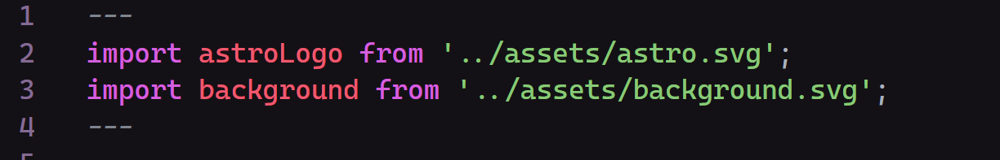
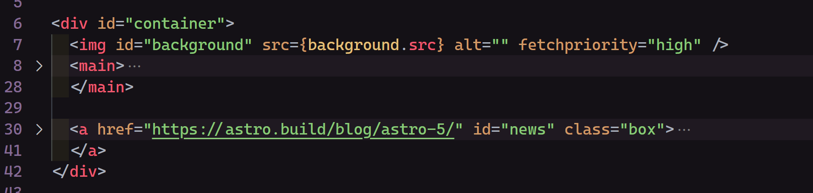
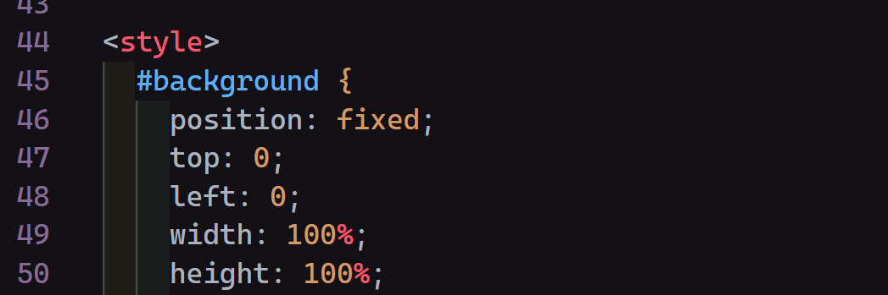
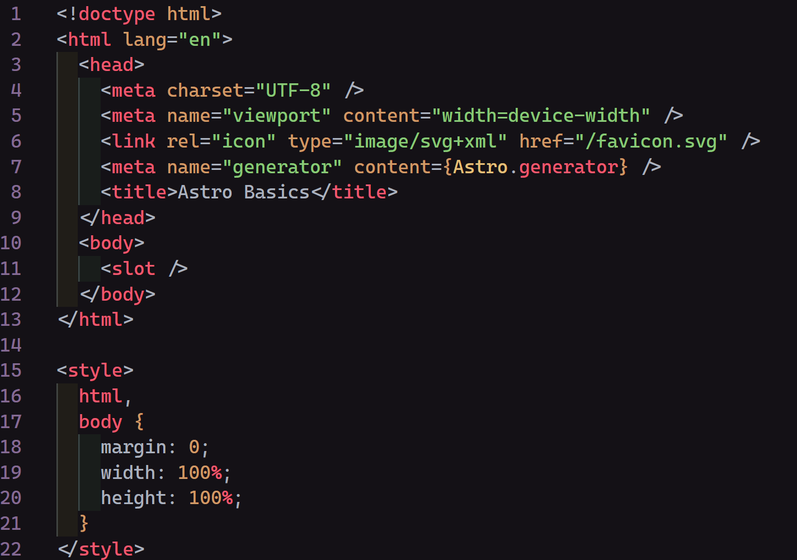

# Astro 🚀

## Introducción

Astro ([web](https://astro.build/)) es un framework de JavaScript (llamado JS de ahora en más) pensado para hacer páginas estáticas centradas en el contenido, como blogs o landing pages entre otras; no obstante Astro permite crear culaquier tipo de página. Las principales características de Astro son:

1. Agnostico a la UI: Esto quiere decir que Astro permite utilizar la mayoría de frameworks frontend más importantes, React, Preact, Svelt, Vue y Solid. Esto implica que con Astro podemos usar cualquiera de ellos, los 5 a la vez, dos o ninguno sin problemas.

2. Content Collections/Content Layers: Estas son colecciones de contenido que nos ayudan a la hora de manejar el contenido que mostramos el la página, post de un blog (productos de un ecommers, etc).

3. Cero JavaScript, por defecto: Por defecto Astro no manda JS al cliente, lo que ayuda al rendimiento.

4. View Transitions: Astro nos otorga una forma sencilla de usar la View Transition API para hacer transiciones entre páginas.

5. Plantillas: Astro posee muchas plantillas creadas por la comunidad que podemos utilizar como queramos, desde blogs, documentación, landing pages, entre otras.

## Crear Proyecto de Astro

En la página de Astro nada más entrar nos proporciona el comando para crear un proyecto `npm create astro@latest` o `pnpm/yarn create astro --template starlight` el cual lo hace con la última versión de Astro, tras esto nos hará una serie de preguntas sobre el proyecto:

1. Nomre del proyecto
2. Incluir archivos por defecto (recomendable), blog template, o vacío.
3. Instalar dependencias (sí o no)
4. Inicializar repositorio (sí o no)

*Astro por defecto busca que escribamos TS*

En VS Code tenemos que instalar la [extensión de Astro](https://marketplace.visualstudio.com/items?itemName=astro-build.astro-vscode) para que nos resalte correctamente la sintaxis de los archivos `.astro`

### Estructura del Proyecto

El proyecto creado con Astro nos proporciona los siguientes archivos por defecto:

- **astro.config.mjs**
- **tsconfig.json**: en caso de que selecionemos que escribiremos TS
- **public/**: para archivos estáticos
- **src/**: Todo lo referente a la aplicación
- **src/components/**
- **src/layouts/**: los layouts son componentes de Astro que definen la estructura UI compartida por una o más páginas
- **src/pages/**: son las rutas de nuestra página, los tipos de archivos soportados son ".astro", ".md", ".mdx" (con la integración de MDX instalada), ".html", ".js/.ts" (como endpoints)

## Sintaxis de Astro

Para seguir la siguiente explicación recomiendo ver el archivo por defecto `*/src/components/Welcome.astro` creado por `npm create astro@latest`

Al principio de los archivos `.astro` nos encontramos un bloque encerrado entre 3 guiones medios (`---`), es allí donde podemos escribir JS o TS, es decir, es donde hacemos los imports de componentes, fetching de datos, acceder a props, etc.



Si bajamos nos encontramos algo HTML que es aquello que se renderiza, si vemos `*/src/pages/index.astro` veremos que no solo puede ser HTML si no también componentes.



Por último nos encontramos una etiqueta `<style>` que engloba los estilos que le daremos a esa parte de la página, cabe aclarar que estos estilos no son globales, tienen un scope limitado al archivo en el que se encuentran.



En caso de que queramos que unos estilos sean globales debemos asignarle la directiva (ver [Directivas de Maquetado](#directivas-de-maquetado)) "is:global" como se ve a continuación.

```astro
<style is:global>
  <!-- ... -->
</style>
```

Es de aclarar que a diferencia de React, Astro no requiere que exportemos nada, el archivo en sí es el componente.

## Variable Global Astro

En todos los archivos `.astro` tenemos acceso a la variable Astro la cual guarda las propiedades que se le pasan al componente de Astro, cookies, respuestas, entre otas cosas.

## Integrar Frameworks a Astro

Para integrar un framework con Astro en la mayoría de los casos es tan simple como ejecutar `npx astro add <framework>` o `pnpm/yarn astro add <framework>`. Para ver todas las integraciones que podemos hacer con este comando ejecutamos `npx astro add --help`, no obstante aquí está la lista actualizada al día 18/02/2025:

- Frameworks UI:
    - react
    - preact
    - vue
    - svelte
    - solid-js
    - lit
    - alpinejs
- Frameworks de Documentación:
    - starlight
- Adaptadores SSR:
    - netlify
    - vercel
    - deno
    - cloudflare
    - node
- Otros:
    - db
    - tailwind
    - mdx
    - markdoc
    - partytown
    - sitemap

Que un framework no se encuentre en esta lista no implica que no se pueda usar junto con Astro, simlplementa hay que buscar una integración hecha por la comunidad y hacerla manualmente.

## Layouts y Slot

Los layouts son componentes que están pensados para envolver toda la página, son los que tienen la etiqueta "html", "body", "head", todas las etiquetas "meta", etc, si vemos el layout por defecto de Astro en `*/src/layouts/Layout.astro` veremos que es justamente esto:



Pero hay algo peculiar en este archivo y es la etiqueta "<slot\>" dentro de "<body\>" esta etiqueta slot es el equivalete a la igualmente llamada en Vue y Svelt y a "children" en React, esta contiene todo lo que se le pase como hijo al componente de Astro. es decir,  que si en nuestro `*/src/pages/index.astro` tenemos lo siguiente:

```astro
---
import Layout from '../layouts/Layout.astro'
---

<Layout>
	<h1>Hola Mundo</h1>
  <p>Texto de ejemplo</p>
</Layout>
```

Se renderizará el h1 y el párrafo dentro de la etiqueta "body" del Layout.astro

Ahora supongamos que tenemos un componente MenuBtn y queremos poder indicar facilmente si el icono va antes o después del texto siendo ambos hijos del componente, si bien podríamos directamente cambiar el orden de estos al momento de pasarlos al componente es más práctico usar slots nombrados. Para ello en nuestro componente MenuBtn hacemos lo siguiente:

```astro
<!-- path: */src/components/MenuBtn.astro -->
<a class="menu-btn">
  <!-- Le asignamos un nombre a este slot -->
  <slot name="before">

  <!-- A los hijos que no le asignemos un slot especifico van al que no tiene nombre -->
  <slot />

  <slot name="after">
</a>
```

Ahora para asignar un slot a los hijos usamos la propiedad de Astro "slot" como se ve a continuación: 

```js
// path: */src/components/Menu.astro

// Pongo como bloques separados el JS del resto del archivo .astro para que MD dé el formato correcto
---
import MenuBtn from "./MenuBtn.astro"
import InfoIcon from "./icons/Info.astro" // Esto sería un SVG, suponemos que está aparte para reducir el código de ejemplo
import ProductsIcon from "./icons/Products.astro"
---
```
```astro


<div class="main-menu">
  <MenuBtn>
    <InfoIcon slot="before">
    Información
  </MenuBtn>
  <MenuBtn>
    Productos
    <ProductsIcon slot="before">
  </MenuBtn>
</div>
```

En este caso ambos iconos se mostraran antes del texto, porque es texto se asigna al slot por defecto mietras que el slot de ambos iconos se encuentra antes que ese

## Enrutamiento en Astro

Al igual que otros frameworks como NextJS Astro usa el sistema de archivos para definir las rutas, en este caso usa el directorio `*/src/pages/`, por ejemplo, si tenemos un archivo `index.astro` en ese directorio será ese el que se cargue namas abrir la página ("mipagina.com/"), por otro lado si tenemos un `about.astro` este archivo se servirá al acceder a "mipagina.com/about"

### Error 404

Si creamos una página llamada "404.*" Astro lo interpretará como la página que debe mostrar al no encontrar otra.

### Rutas Dinamicas

A la hora de crear rutas dinámicas en Astro tenemos dos opciones, una es crear TODAS las posibles rutas, lo que mantiene el enfoque estático de Astro o por otro lado hacer que Astro funcione con SSR (Server Side Rendering).

En cualquiera de los dos casos para indicar que una parte de la URL es dinámica lo hacemos poniendola entre corchetes, por ejemplo, si queremos tener una ruta `mitienda.com/productos/ab104` siendo "ab104" una ID de producto deberiamos tener los siguiente dentro de la carpeta "pages" de nuestro proyecto

```text
pages
  |-- productos
        |--- [id].astro
```

#### Generar Todas las Rutas

Para generar todas las rutas tenemos que exportar una función llamada "getStaticPath" desde nuestro archivo `pages/productos/[id].astro` la cual debe devolver un Array de objetos cuya única clave sea `params` y su valor sea un objeto con los parametros de la URL, en nuestro caso sería el siguiente:
```js
{
  id: 'ab104'
}
```

De esta forma nuestro `[id].astro` quedaría de la siguiente manera:

```ts
---
import type { GetStaticPaths } from "astro"; // <-- si trabajamos con TS

export const getStaticPaths = (async () => {
  return [
    {
      params: {
        id: 'ab104'
      }
    },
    {
      params: {
        id: 'ab105'
      }
    }
    // ...
  ]
}) satisfies GetStaticPaths;

// Logica de que según el ID obtener los datos del producto
const { id } = Astro.params
// ...
---
```
```astro
<!-- Resto del Componente -->
```

Hacer esto es claramente poco práctico pero lo que podemos hacer es una llamada a una API que nos proporcione las IDs de todos los productos:

```ts
---
import type { GetStaticPaths } from "astro";

export const getStaticPaths = (async () => {
  const products = await fetch('/api/products').then(res => res.json())

  return products.map(p => {
    return {
      params: {
        id: p.productId
      }
    }
  })
}) satisfies GetStaticPaths;

const { id } = Astro.params
// ...
---
```

Esto lo que hará es que al momento de compilar nuestra aplicación (ejecutar `npm run build`) Astro va a crear todas las posibles páginas estáticas. Usar este enfoque puede ser útil cuando sabemos exactamente cuántas páginas va a haber, por ejemplo, en una tienda que sabemos que tiene 120 productos a disposición.

#### Astro con SSR

Ahora supongamos que queremos trabajar con SSR, para ello tenemos que ir a nuestro archivo `astro.config.mjs` y definir la propiedad `output` con el valor `server` (valor por defecto `static`) lo que indica a Astro que no debe servir las páginas de forma estática si no dinámica

```mjs
// @ts-check
import { defineConfig, envField } from 'astro/config';

import tailwindcss from '@tailwindcss/vite';

// https://astro.build/config
export default defineConfig({
  output: 'server'
});
```

De esta forma no necesitamos crear un `getStaticPaths` porque se crearan bajo demanda. Siguiendo con el ejemplo anterior de `pages/productos/[id].astro` el código quedaría de la siguiente manera:

```ts
---
import type { GetStaticPaths } from "astro"; // <-- si trabajamos con TS

// Logica de que según el ID obtener los datos del producto
const { id } = Astro.params
// ...
---
```
```astro
<!-- Resto del Componente -->
```

El problema de hacer esto es que ahora TODAS las página de nuestra aplicación funcionan con SSR lo que complica las cosas.

Si queremos hacer que un solo archivo empleé SSR mientras que el resto sigan siendo estáticos lo que podemos hacer es no modificar el `astro.config.mjs` e incluir al principio de `pages/productos/[id].astro` la siguiente linea:

```ts
export const prerender = false // <-- renderizado bajo demanda
```

Por el contrario si queremos que todo el proyecto sea SSR pero que algún archivo individual sea estático ponemos el `output` del proyecto en `server` y vamos a ese archivo que debe ser renderizado estaticamente y exportamos al principio del archivo `prerender = true` 

```ts
export const prerender = true // <-- renderizado estático
```

Es importante tener en cuenta que vamos a nececitar agregar un adaptador SSR para poder desplegar nuestra aplicación, si no lo hacemos al ejecutar `npm run build` tendremos un error

## Directivas de Maquetado

Las directivas de maquetado son atributos especiales de HTML disponibles dentro de los componentes de Astro.

Las directivas de maquetado se utilizan para controlar el comportamiento de un elemento o componente de una forma concreta. Una directiva de maquetado puede habilitar alguna característica del compilador que nos hagan la vida más fácil, o puede decirle al compilador de Astro que haga algo especial con ese componente.

Todas las directivas de Astro incluyend ":" en su sintaxis

A continuación veremos algunas directivas que son especialmente interesantes y utiles, además de clasificarlas de la misma forma que se hace en la documentación de Astro

### Algunas Directivas Comunes ([docs](https://docs.astro.build/es/reference/directives-reference/#directivas-comunes))

#### class:list

Toma un array de clases y los convierte en un string. impulsado por la biblioteca auxiliar [clsx](https://github.com/lukeed/clsx)

class:list toma un array de varios tipos de valores posibles diferentes:
- `string`: Agregado al atributo `class`
- `Object`: Todas las keys verdaderas se agregan al atributo `class`
- `Array `: aplanado
- `false `, `null`, o `undefined`: Omitido

```astro
<!-- Esto -->
<span class:list={[ 'hola foo', { mundo: true }, [ 'buz' ] ]} />
<!-- Se convierte en -->
<span class="hola foo mundo buz"></span>
```

### Directivas de Script y Style ([docs](https://docs.astro.build/es/reference/directives-reference/#directivas-script--style))

#### is:global

Hace que los estilos de esta estiqueta `<style>` se apliquen globalmente cunado el componente se renderiza.

### Directivas del Cliente ([docs](https://docs.astro.build/es/reference/directives-reference/#directivas-del-cliente))

In progress...

## Content Collections ([docs](https://docs.astro.build/en/guides/content-collections/))

Las colecciones de contenido son un conjunto de datos que están estructurados similar, pueden ser post de un blog, un archivo JSON con productos o cualquier dato que represente una serie de elementos con la misma forma.

Astro nos otroga una API para buscar y configurar estas coleciones, las cuales deben estar detro de la carpeta `src/content`, que se importa como `astro:content`.

Para definir las coleciones lo primero es crear la carpeta `content` dentro de `src`, será dentro de esta donde creemos y configuremos nuestras colecciones.

Supongamos que queremos tener una colección de libros a la venta, la cual llamaremos "books", que sean archivos .md que sigan la siguiente estructura:

```md
---
title: string
author: string
img: url
readtime: number
description: string
buy:
  spain: url
  usa: url
---

Amazon Description... (string)
```

Para ello creamos una carpeta dentro de `content` con el nombre de la coleción, y dentro de ella pondremos todos los MarkDown de los libros

A continuación debemos definir las coleciones, para ello creamos un archivo `config.ts` dentro de la carpeta `content` que es donde ocurre la magia

```text
src
 |-- content
        |--- books
        |      |--- book1.md
        |      |--- book2.md
        |      |--- book3.md
        |--- config.ts
```

En nuestro archivo de configuración debemos hacer tres cosas al definir una coleción:

1. Definir el `loader` de la coleción, para definir de dónde extraer los datos
2. Definir el esquema de la coleción ayudandonos con Zod, para el tipado de TS (opcional)
3. Exportar la constante `collections` que debe ser un objeto con las coleciones

Este proceso se ve a continuación:

```ts
import { defineCollection, z } from "astro:content";
// z --> Zod Schema

import { glob } from "astro/loaders";
// glob --> loader para directorios de archivos de cualquier lugar del sistema de archivos
/* Sintaxis
glob({
  pattern: string | string[],
  base?: string | URL (default: "."),
  generateId?: (options: GenerateIdOptions) => string
})
*/

// - pattern: matron que deben cumplir los archivos generalmente usado para definir el tipo de archivo. Ej: "**/*.md" (todos los .md), "**./*.(md|mdx)" (todos los .md y .mdx)
// base: directorio donde base donde buscar, por defecto busca desde la raiz del proyecto, en general su valor será al parecido a ".src/content/collectionName"
// generateId: callback para generar un ID unico para esa entrada de la coleción, por defecto es el nombre del archivo sin la extensión

const books = defineCollection({
  // todos los .md (pattern) dentro de "./src/content/books" (base)
  loader: glob({ pattern: '**/*.md', base: './src/content/books' }),
  schema: z.object({
    title: z.string(),
    author: z.string(),
    img: z.string(),
    readtime: z.number(),
    description: z.string(),
    buy: z.string().url(),
  })
})

export const collections = { books }
```

`glob` y `file` son los dos buildin loaders más importantes, la principal diferencia entre ellos es que `glob` es para directorios de archivos MD, MDX, JSON o YAML y `file` para archivos individuales JSON o YAML

Por último para usar la coleción nos apoyamos de la función `getCollection` en el archivo que la necesitemos

```js
---
import Layout from '../layouts/Layout.astro';
import { getCollection } from 'astro:content';

const books = await getCollection('books')
---
```
```jsx
<Layout title='Astro Books'>
  {
    books.map(b => {
      const { id, data } = b
      const { title, author, img, readtime, description, buy } = data

      return (
        <article>
          <a href={`libro/${id}`}>
            
          </a>
          <div>
            <h2>
              {title}
            </h2>

            <p>{description}</p>
            <span>Lectura en {readtime} minutos</span>
          </div>
        </article>
      )
    })
  }
</Layout>
```

En el caso de que queramos acceder al contenido escrito en el MD la forma más fácil de hacerlo es importando la función render de `astro:content` y usarla de la siguiente manera:

```js
import type { GetStaticPaths } from "astro";
import { getCollection, render } from "astro:content";
import Layout from "../../layouts/Layout.astro";

export const getStaticPaths = (async () => {
  const books = await getCollection('books')
  
  return books.map(b => ({
    params: {id: b.id},
    props: {book: b}
  }));
}) satisfies GetStaticPaths;

const { book } = Astro.props
const { data } = book
const { title, author, img, readtime, description, buy } = data

const { Content } = await render(book)
```
```astro
<Layout>
  <main>
    <!-- Esto muestra el contenido del MD -->
   <Content />
  </main>
</Layout>
```

## View Transitions

Las View Transitions son una API nativa de JS que permite hacer transiciones entre navegaciones, por ejemplo, podriamos tener una galeria de fotos en nuestra raiz (url "/") y que al hacer click en una de ellas no solo nos dirija a ver la foto en grande con algo de información, también que la imagen se desplace y haga más grande a modo de transición.

Esto se puede hacer si necesidad de Astro con HTML y CSS siguiendo la [documentación](https://developer.mozilla.org/en-US/docs/Web/API/View_Transition_API), no obstante astro nos lo facilita enormemente.

En primer lugar debemos envolver la parte de nuestra aplicación a la que queramos aplicar view transitions con el componente `ClientRouter` de `astro:transitions`, pero por lo general nos bastará con ponerlo en el elemento `head` de nuestros layouts

```js
---
import { ClientRouter } from 'astro:transitions'

interface Props {
  title: string
}

const { title } = Astro.props
---
```
```jsx
<!doctype html>
<html lang="es">
	<head>
		<meta charset="UTF-8" />
		<meta name="viewport" content="width=device-width" />
		<link rel="icon" type="image/svg+xml" href="/favicon.svg" />
		<meta name="generator" content={Astro.generator} />
		<title>{title}</title>
    <ClientRouter />
	</head>
	<body>
    <slot />
	</body>
</html>
```

A continuación para decir que un elemento se tiene que transformar en otro entre navegaciones simplemente tenemos que asignarle la directiva `transition:name` cuyo valor debe ser un identificador único, esto para que Astro pueda relacionar los elementos de forma correcta
```ts
---
// path: "src/pages/index.astro"
import Layout from '../layouts/Layout.astro';
import { getCollection } from 'astro:content';

const images = await getCollection('images')
---
```
```jsx
<Layout>
  {
    images.map(image => {
      const { id, data } = image
      const { url, desc, date } = data
      return (
        <a href={`/image/${id}`}>
          
          <span>{date}</span>
          <p>{desc}</p>
        </a>
      )
    })
  }
</Layout>
```

A continuación nos dirigimos a `src/pages/image/[id].astro`. Para hacer que Astro pueda relacionar dos elementos debemos asignarle al otro el mismo valor de `transition:name`

```ts
---
// path: "src/pages/image/[id].astro"
import type { GetStaticPaths } from "astro";
import { getCollection, render } from "astro:content";
import Layout from '../layouts/Layout.astro';

export const getStaticPaths = (async () => {
  const images = await getCollection('images')
  
  return images.map(image => ({
    params: { id: image.id },
    props: { image }
  }));
}) satisfies GetStaticPaths;

const { image } = Astro.props
const { data, id } = image
const { url, desc, date } = data
---
```
```jsx
<Layout>
  <main>
    <!-- Asignamos el mismo transition:name -->
    
    <span>{date}<span>
    <p>{desc}<p>
  </main>
</Layout>
```

## Server Islands

Una isla de servidor hace referencia a que toda la página es estática a excepción de un componente especifico, el cual se renderiza desde el servidor (comportandose similar a un React Server Component).

Para crear una isla de servidor el primer paso es hacer que nuestra aplicación sea renderizada desde el servidor modificando el `output` de la configuración de Astro a `server` después debemos indicar en cada página que deba ser estática que se prerenderice al empaquetar la aplicación exportando la constante `prerender` como `true` (esto es igaul a lo que se vió en [Astro con SSR](#astro-con-ssr))

A continuación debemos darle la directiva `server:defer` al componente que deseamos que sea dinámico como se ve a continuación:

```jsx
<Layout title={title}>
  <HotelScore server:defer />
</Layout>
```

En caso de que queramos que algo se muestre algo en el frontend mientras el componente se renderiza en el servidor podemos pasarselo como hijo en el slot `fallback`:

```jsx
<Layout title={title}>
  <HotelScore server:defer>
    <p slot="fallback">
      Cargando calificación...
    </p>
  <HotelScore>
</Layout>
```

Nuevamente, necesitaremos un adaptador SSR para poder desplegar nuestra aplicación.

## Documentación con Starlight

Gracias a que Astro está pensado para sitios estáticos es muy bueno para crear documentaciones.

Si bien es cierto que podriamos hacerlo todo a mano lo mejor es usar una plantilla como [starlight](https://starlight.astro.build/), veamos un ejemplo con esta plantilla creada por el equipo de Astro.

### Instalación

Crear un proyecto de Astro con Starlight es muy sencillo, tenemos que crear el proyecto de Astro agregando la bandera `-- --template starlight` en npm y `--template starlight` en pnpm y yarn

```sh
npm create astro@latest -- --template starlight
```

o

```sh
pnpm/yarn create astro --template starlight
```

### Configuración de Starlight ([docs](https://starlight.astro.build/reference/configuration/))

Dentro del archivo de configuración de astro `astro.config.mjs` encotramos la configuración de la integración de starlight con Astro

```mjs
import { defineConfig } from 'astro/config';
import starlight from '@astrojs/starlight';

export default defineConfig({
	integrations: [
		starlight({
			// ...
		}),
	],
});
```

A starkight podemos pasarle una serie de propiedades, entre las que se puede destacar las siguientes:

- title (obligatoria): `string | Object`, el título de la página web también usado para los metadatos. En caso de que sea un objeto cada clave debe corresponder a un idioma según etiquetas BCP-47 y como valor el título en ese idioma.
- description: texto usado como descripción en los metadatos de la página.
- logo: imagen para mostrar en la barra de navegación junto al título de la página o en su lugar, se le puede pasar un objeto siguiendo el siguiente esquema:
```ts
type LogoConfig = { alt?: string; replacesTitle?: boolean } & (
  | { src: string }
  | { light: string; dark: string }
)
```
- TableOfContent: `false | { minHeadingLevel?: number; maxHeadingLevel?: number; }`, Configura la tabla de contenidos que se muestra a la derecha de cada página. Por defecto sólo los encabezados <\h2> y <\h3> se incluyen.
- sidebar: Configura la barra lateral de navegación ver [Barra Lateral o Sidebar](#barra-lateral-o-sidebar-docs).
- social: Cuentas de redes sociales para este sitio. Se mostrarán como iconos en el encabezado de sitio. `Array<{ label: string; icon: StarlightIcon; href: string }>` (ver [iconos de starlight](https://starlight.astro.build/es/reference/icons/))
- favicon: path al favicon por defecto alojado en el directorio `public/`.
- creadits: si es `true` pone un enlace de "echo con starlight" en el footer.

> [!WARNING]
> IN PROGESS

### Entradas de la Documentación

Starlight se encarga de crear una content collection llamada "docs" en la que debemos ir agregando cada una de las entradas, las cuales deben estar en formato `.md` o `.mdx`. Nosotros podemos especificar una multitud de campos en el `frontmatter` de cada uno de ellos pero los más importantes son:

- title (obligatorio): Es el texto que se mostrará como título de la entrada, en la pestaña del navegador, y como metadata de la página.
- description: utilizada para como metadata de la página. Aunque no es obligatoria es muy recomendable ponerla siempre.
- slug: Cambia el slug (url) de la página
- template: `doc` o `splash` define el Layout que usará esa página, por defecto es `doc`, `splash` no cuenta con la barra lateral ni tabla de contenidos, está diseñada para landingpages o cosas por el estilo
- hero: añade un componente `Hero` en la parte superior de la pantalla, funciona especialmente bien con `template: splash` (admite varios capos, ver [frontmatter hero](https://starlight.astro.build/reference/frontmatter/#hero))
- prev: `bool | string | { link?: string, label?: string }`, por defecto muestra un botón para ir a la entrada anterior, `false` hace que este botón no se muestre, un `string` cambia su texto y un objeto modifica tanto el texto como el enlace a donde redirige.
- next: lo mismo que `prev` pero para la entrada siguiente.
- sidebar: controla cómo la entrada se muestra en la [barra lateral](#barra-lateral-o-sidebar) cuando esta es autogenerada ([ver docs](https://starlight.astro.build/reference/frontmatter/#sidebar)).


### Barra Lateral o Sidebar ([docs](https://starlight.astro.build/guides/sidebar))

La barra lateral es la que permite navegar por la documentación, por defecto esta sigue la estructura de carpetas del proyecto.

Toda configuración que queramos hacer sobre la barra lateral debe ir dentro de la configuración de starlight en el archivo `astro.config.mj`

> [!WARNING]
> IN PROGESS